В репозитории хранится PDF версия отчёта, сделанная в редакторе Obsidian.

Исходный код находится в папке `/src/`.

## Подготовка окружения и проверка версий

В первую очередь включаем кодировку UTF-8, чтобы в консоли корректно отображался кириллический вывод:

```powershell
chcp 65001 | Out-Null
```

Проверяем, что инструменты Git и CLI для Go доступны:

```powershell
go version
git --version
```

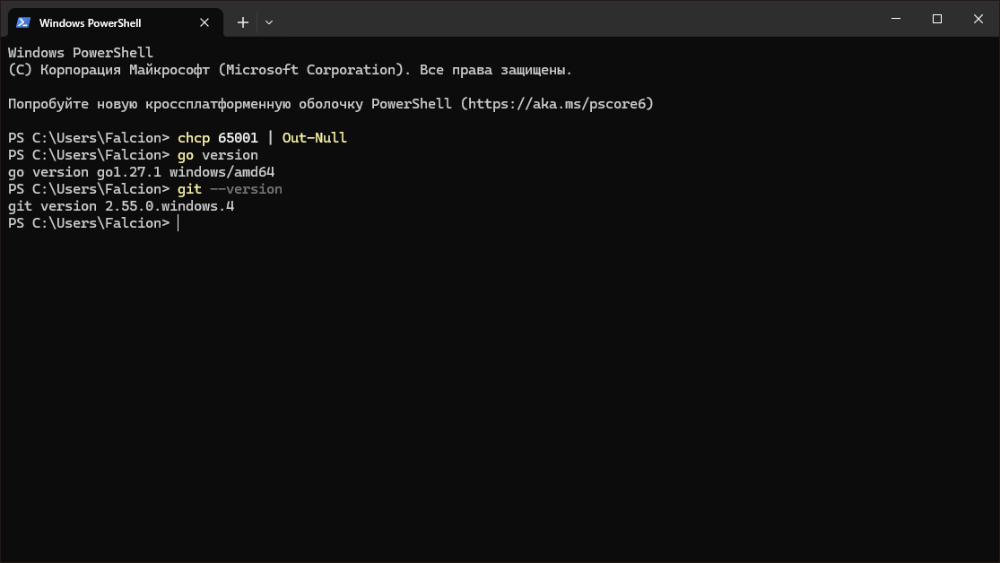
## Структура проекта и инициализация модуля

Выбираем рабочую папку. Создаём проект и инициализируем модуль:

```powershell
mkdir helloapi
cd helloapi
go mod init example.com/helloapi
```

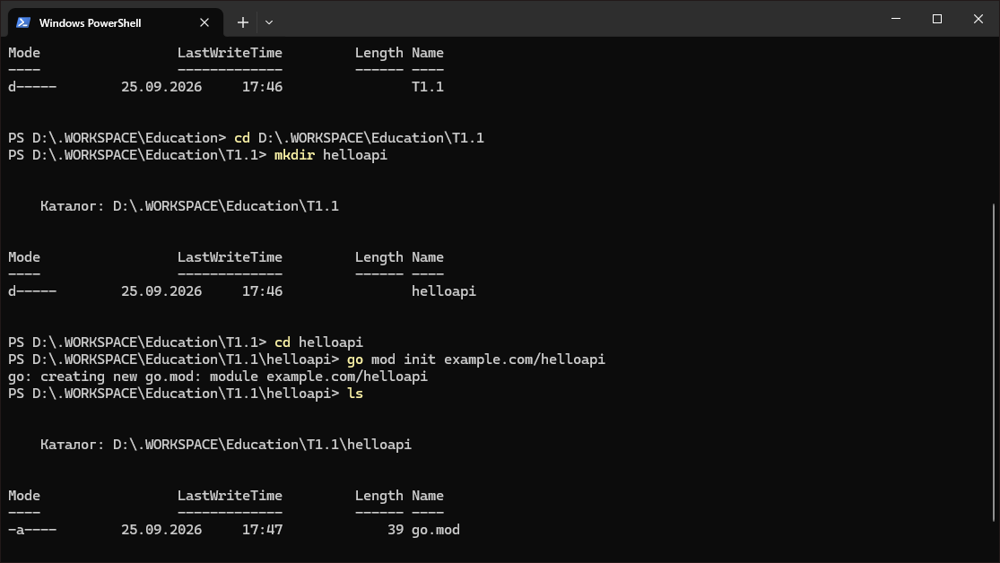

Создаём структуру каталогов:

```powershell
mkdir cmd\server
```

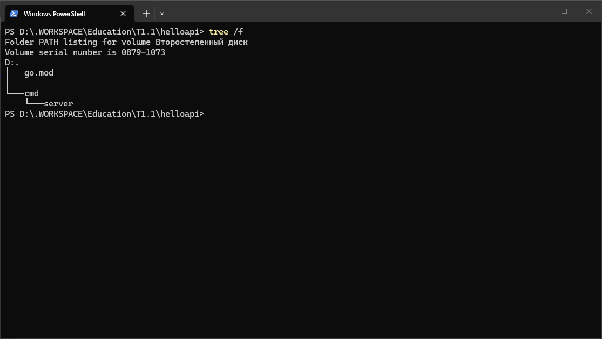
## Минимальный HTTP-сервер (первая версия)

Создаём файл `cmd\server\main.go` и вставляем код:

```go
package main

import (
	"encoding/json"
	"fmt"
	"log"
	"net/http"
)

type user struct {
	ID   string `json:"id"`
	Name string `json:"name"`
}

func main() {
	mux := http.NewServeMux()

	// Текстовый ответ
	mux.HandleFunc("/hello", func(w http.ResponseWriter, r *http.Request) {
		fmt.Fprintf(w, "Hello, world!")
	})

	// Пока временный JSON (без UUID — добавим на шаге 4)
	mux.HandleFunc("/user", func(w http.ResponseWriter, r *http.Request) {
		w.Header().Set("Content-Type", "application/json")
		_ = json.NewEncoder(w).Encode(user{
			ID:   "temp",
			Name: "Gopher",
		})
	})

	addr := ":8080"
	log.Printf("Starting on %s ...", addr)
	log.Fatal(http.ListenAndServe(addr, mux))
}
```
## Подключение внешней зависимости и доработка `/user`

Подтягиваем пакет для генерации UUID:

```powershell
go get github.com/google/uuid@latest
go mod tidy
```

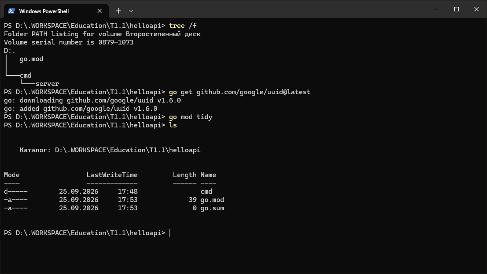

Правим `cmd\server\main.go`: добавляем импорт `github.com/google/uuid` и заменяем `"temp"` на реальный UUID:

```go
mux.HandleFunc("/user", func(w http.ResponseWriter, r *http.Request) {
	w.Header().Set("Content-Type", "application/json")
	_ = json.NewEncoder(w).Encode(user{
		ID:   uuid.NewString(), // теперь реальный UUID
		Name: "Gopher",
	})
})
```
## Запуск сервера и быстрая проверка

Из корня проекта запускаем сервер:

```powershell
go run ./cmd/server
```

Запускаем сервер:

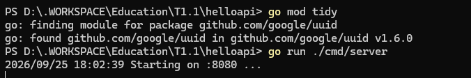

Проверяем эндпоинты:

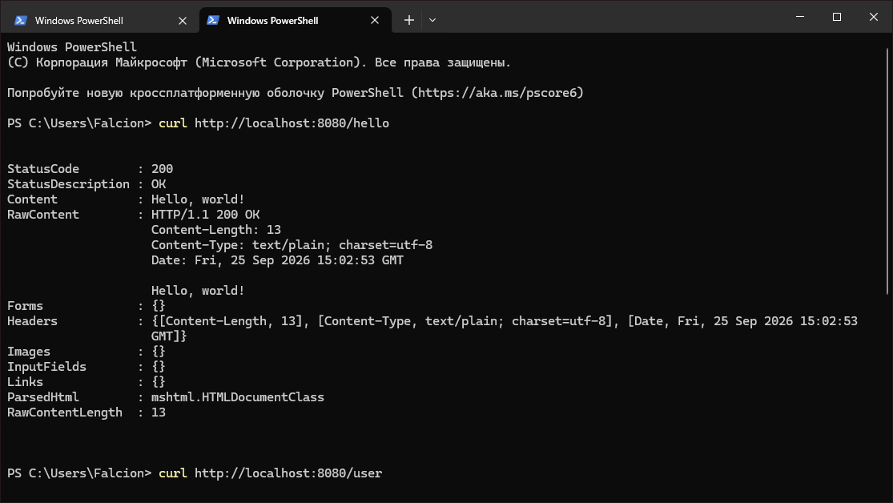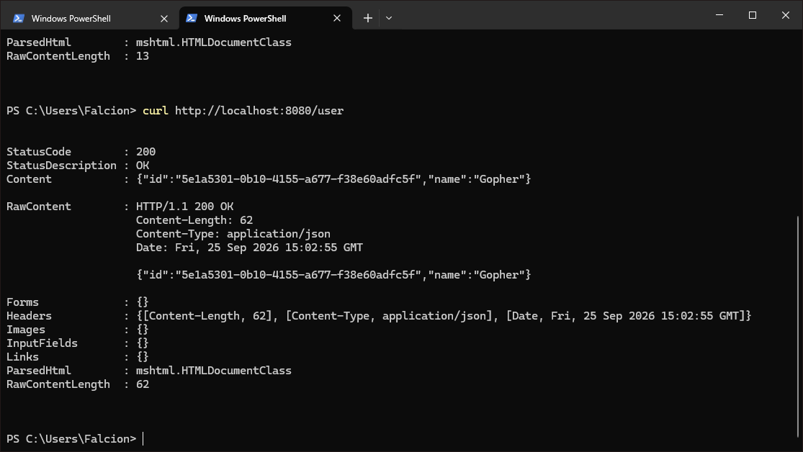
## Сборка бинарника и повторная проверка

Собираем проект в бинарник:

```powershell
go build -o helloapi.exe ./cmd/server
```

Запускаем собранный бинарник:

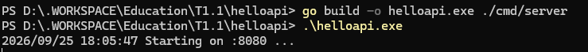

Проверяем эндпоинты аналогичным способом:

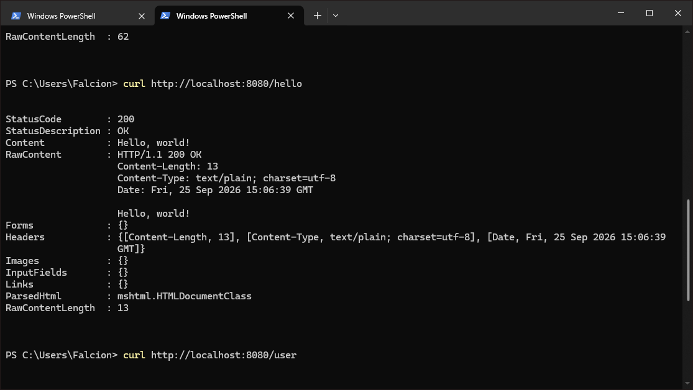
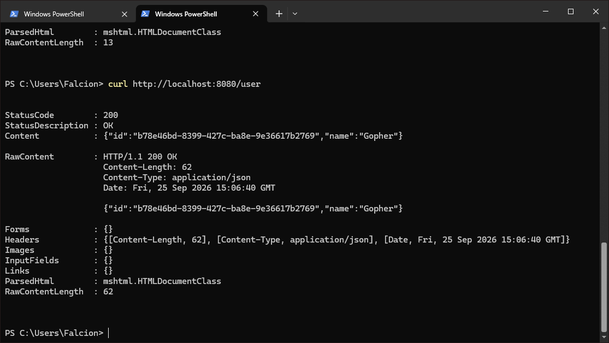
## Линтер и базовые проверки

Форматируем код и запускаем встроенный анализатор:

```powershell
go fmt ./...
go vet ./...
```

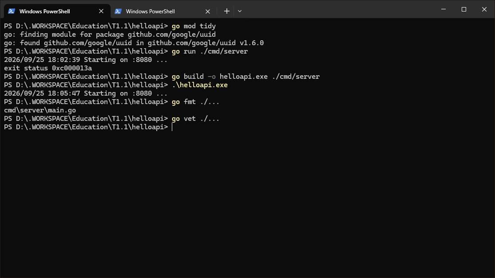
## Опциональное задание на конфигурацию через ENV и создание сигнала сервера

Доработаем приложение: сделаем порт настраиваемым через переменную `APP_PORT`, добавим маршрут `/health` c временем в формате RFC3339 и простое логирование запросов.

```go
package main

import (
	"encoding/json"
	"fmt"
	"log"
	"net/http"
	"os"
	"time"

	"github.com/google/uuid"
)

type user struct {
	ID   string `json:"id"`
	Name string `json:"name"`
}

type health struct {
	Status string `json:"status"`
	Time   string `json:"time"`
}

func main() {
	port := os.Getenv("APP_PORT")
	if port == "" {
		port = "8080"
	}

	mux := http.NewServeMux()

	mux.HandleFunc("/hello", func(w http.ResponseWriter, r *http.Request) {
		log.Printf("%s %s", r.Method, r.URL.Path)
		fmt.Fprintf(w, "Hello, world!")
	})

	mux.HandleFunc("/user", func(w http.ResponseWriter, r *http.Request) {
		log.Printf("%s %s", r.Method, r.URL.Path)
		w.Header().Set("Content-Type", "application/json")
		_ = json.NewEncoder(w).Encode(user{
			ID:   uuid.NewString(),
			Name: "Gopher",
		})
	})

	mux.HandleFunc("/health", func(w http.ResponseWriter, r *http.Request) {
		log.Printf("%s %s", r.Method, r.URL.Path)
		w.Header().Set("Content-Type", "application/json")
		_ = json.NewEncoder(w).Encode(health{
			Status: "ok",
			Time:   time.Now().Format(time.RFC3339),
		})
	})

	addr := ":" + port
	log.Printf("Starting on %s ...", addr)
	log.Fatal(http.ListenAndServe(addr, mux))
}
```

Запуск на другом порту:

```powershell
$env:APP_PORT="8081"
go run ./cmd/server
curl http://localhost:8081/health
```

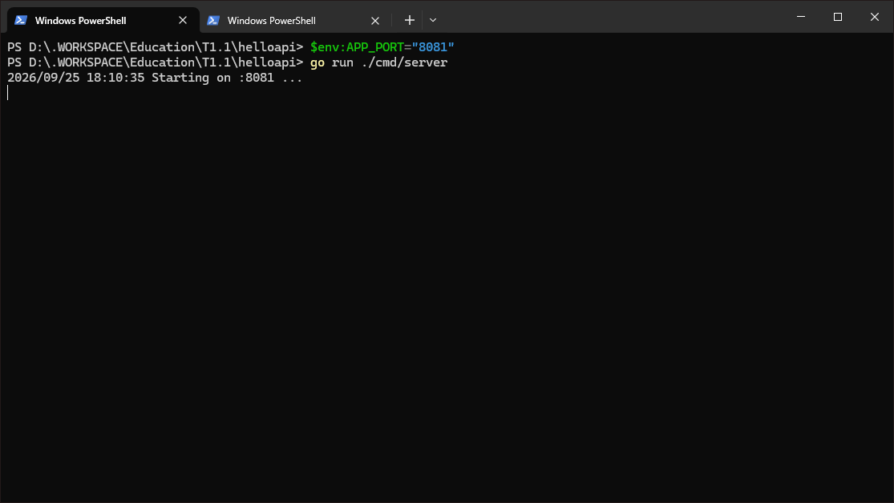
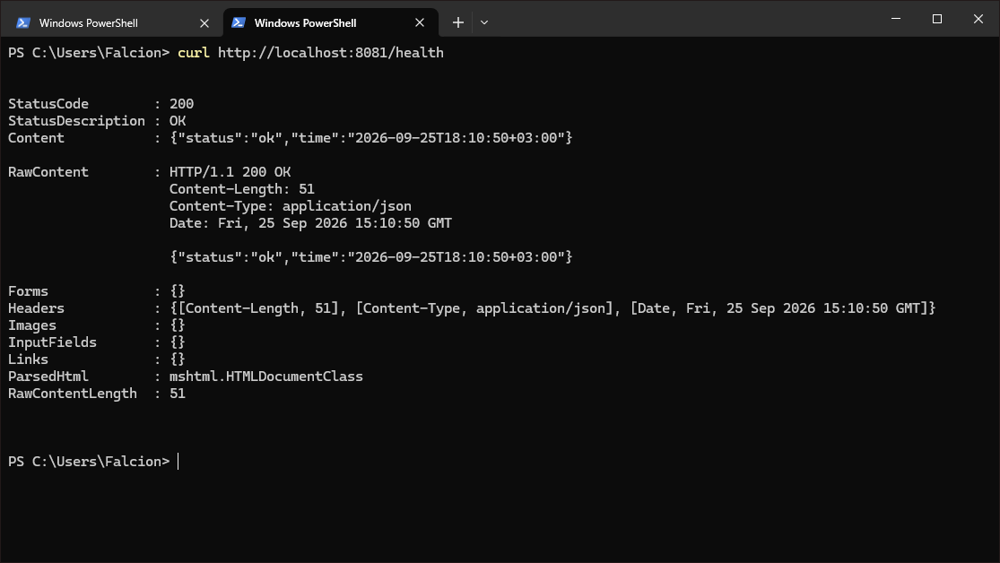