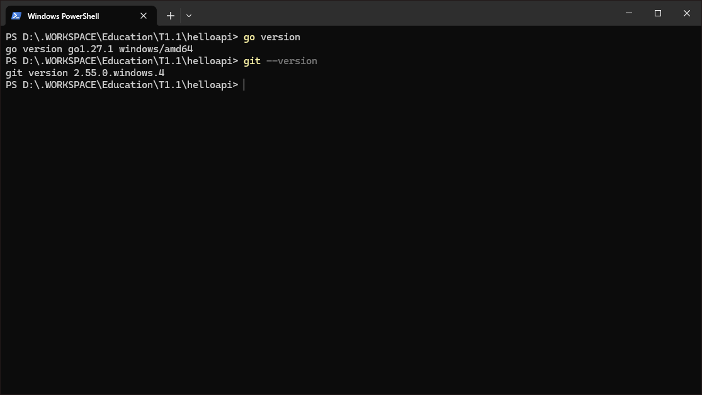
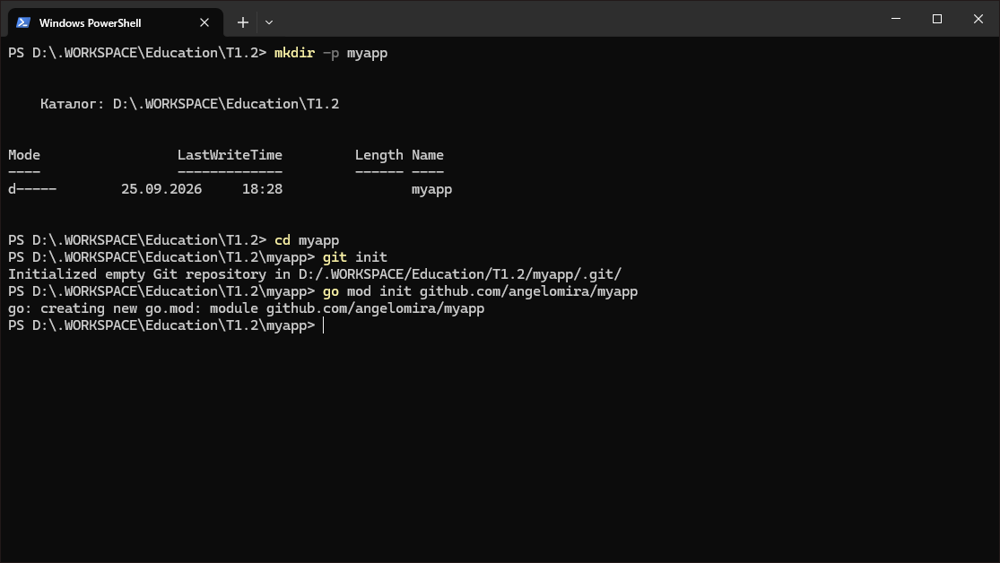
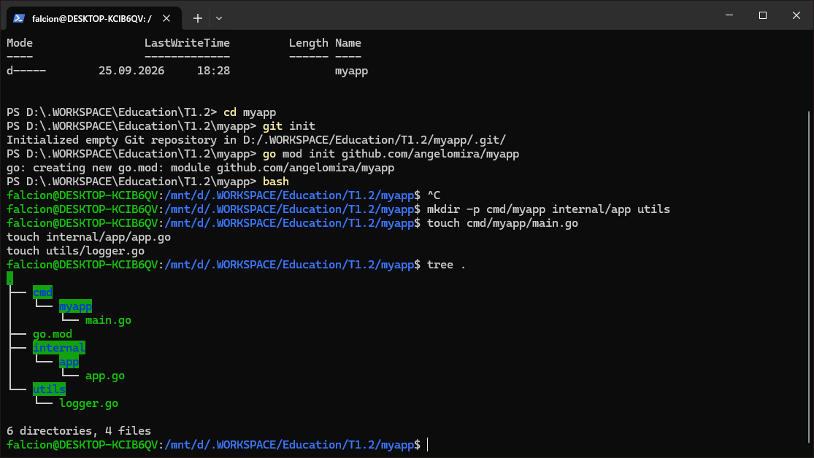
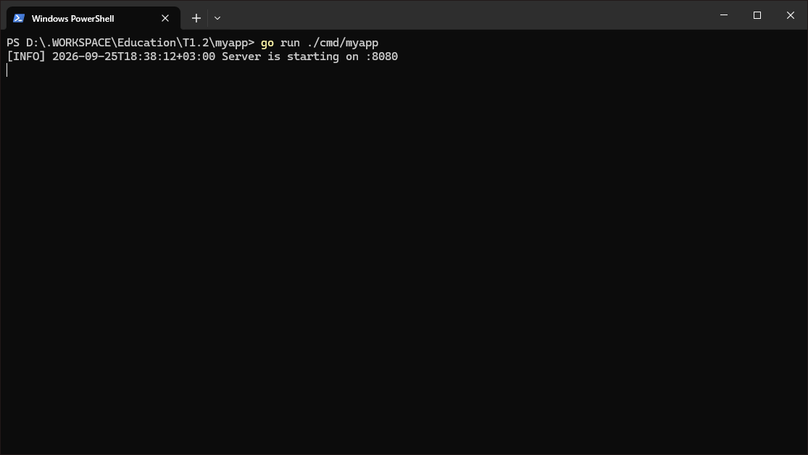
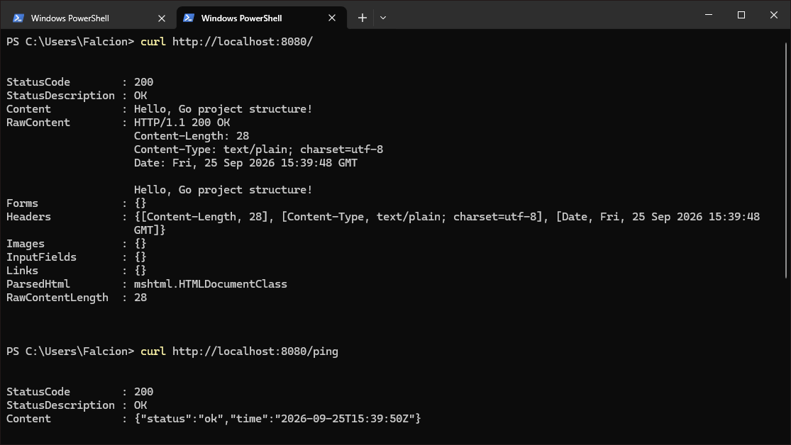
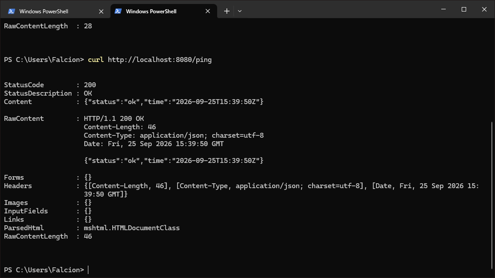
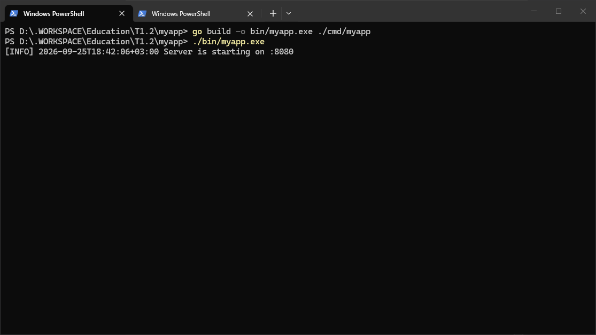
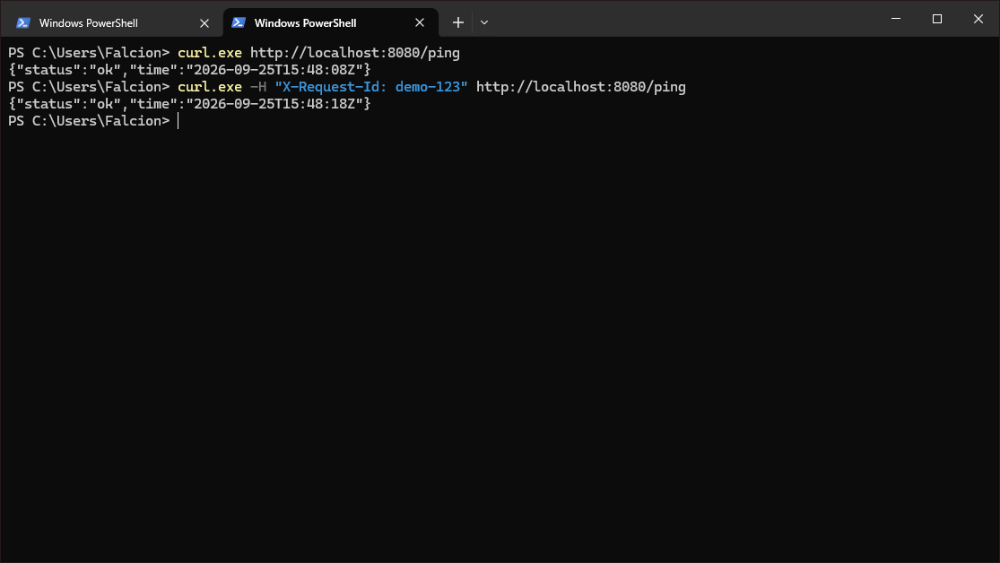
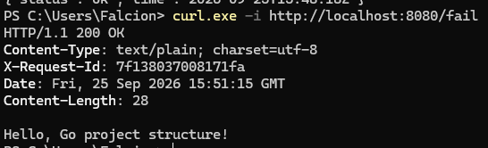
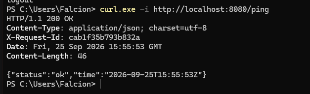

В репозитории хранится PDF версия отчёта, сделанная в редакторе Obsidian.

Исходный код находится в папке `/src/`.

## Требования по "оформлению" репозитории

Учебный проект по дисциплине "Технологии индустриального программирования".
Демонстрирует правильную структуру Go-проекта (cmd, internal, utils).

### Отладка и билд проекта

Для отладки проекта используйте:

```powershell
go run ./cmd/myapp
```

Для билда проекта:

```powershell
go build -o bin/myapp.exe ./cmd/myapp
./bin/myapp.exe
```

### Что, куда и почему

- Скрипты репозиторий и т.п. в папку `scripts/`, дальнейшее разделение иногда подразумевает разделку на языки программирования (`/js/`, `/python`) или сразу на сущности скриптов.
- Т.к. репозиторий находиться на GitHub, то часть CI/CD или элементы, связанные с GitHub (шаблоны тикетов "issues" или пулл реквестов), все такие элементы будут находиться в папке `.github/*`. В ином случае, `Dockerfile`. Позволяет отделить инфраструктурные файлы от исходного кода.
- Миграция и БД: папка `db/` или `migrations`. Они относятся к развертыванию и изменению схемы данных, а не к бизнес-логике.
- Тестирование и моки: `tests/` или `mocks` соотственно. Это изолирует фикстуры и моки от основного кода приложения.
- OpenAPI/Swagger спецификации: `api/`. Контракты API должны быть отделены от кода хендлеров.

## Предварительная подготовка

Убедимся, что установлены необходимые инструменты. Выполним в терминале:

```powershell
go version
git --version
```


## Создание скелета проекта

Создадим папку проекта, инициализируем Git-репозиторий и Go-модуль.

```powershell
mkdir -p myapp
cd myapp
git init
go mod init github.com/angelomira/myapp
```



Настроим `.gitignore` для игнора специальных файлов/папок:

```
/bin/
/dist/
/coverage.out
*.log
```

>P.S.: при создании репозитории в том же GitHub - можно выбрать пресет для игнорирования файлов, в нашем случае - пресет Go.

Создадим структуру папок:

```powershell
mkdir -p cmd/myapp internal/app utils
```

И создадим файлы:

```bash
touch cmd/myapp/main.go
touch internal/app/app.go
touch utils/logger.go
```


### Создание кода для скелета проекта

Код `cmd/myapp/main.go` файла:

```go
package main

import "github.com/angelomira/myapp/internal/app"

func main() {
	app.Run()
}
```

Код `internal/app/app.go` файла:

```go
package app

import (
	"encoding/json"
	"fmt"
	"net/http"
	"time"

	"github.com/angelomira/myapp/utils"
)

type pingResp struct {
	Status string `json:"status"`
	Time   string `json:"time"`
}

func Run() {
	mux := http.NewServeMux()

	mux.HandleFunc("/", func(w http.ResponseWriter, r *http.Request) {
		utils.LogRequest(r)
		w.Header().Set("Content-Type", "text/plain; charset=utf-8")
		fmt.Fprintf(w, "Hello, Go project structure!")
	})

	mux.HandleFunc("/ping", func(w http.ResponseWriter, r *http.Request) {
		utils.LogRequest(r)
		w.Header().Set("Content-Type", "application/json; charset=utf-8")
		_ = json.NewEncoder(w).Encode(pingResp{
			Status: "ok",
			Time:   time.Now().UTC().Format(time.RFC3339),
		})
	})

	utils.LogInfo("Server is starting on :8080")
	if err := http.ListenAndServe(":8080", mux); err != nil {
		utils.LogError("server error: " + err.Error())
	}
}
```

Код `utils/logger.go` файла:

```go
package utils

import (
	"fmt"
	"net/http"
	"time"
)

func LogRequest(r *http.Request) {
	fmt.Printf("[%s] %s %s %s\n",
		time.Now().Format(time.RFC3339),
		r.RemoteAddr,
		r.Method,
		r.URL.Path,
	)
}

func LogInfo(msg string) {
	fmt.Printf("[INFO] %s %s\n", time.Now().Format(time.RFC3339), msg)
}

func LogError(msg string) {
	fmt.Printf("[ERROR] %s %s\n", time.Now().Format(time.RFC3339), msg)
}
```
## Запуск и быстрая проверка

Запустим сервер:

```powershell
go run ./cmd/myapp
```



Проверим эндпоинты:

```powershell
curl http://localhost:8080/
curl http://localhost:8080/ping
```


### Сборка бинарника

Соберем проект и проверим его:

```powershell
go build -o bin/myapp.exe ./cmd/myapp
./bin/myapp.exe
```


## Дополнительные задания
### Задание А: Request-ID и улучшение логов

Добавим генератор ID в `utils/logger.go`:

```go
import (
    "crypto/rand"
    "encoding/hex"
    // ...
)

func NewID16() string {
	b := make([]byte, 8)
	_, _ = rand.Read(b)
	return hex.EncodeToString(b)
}
```

Добавим прослойку в `internal/app/app.go`:

```go
func withRequestID(next http.Handler) http.Handler {
	return http.HandlerFunc(func(w http.ResponseWriter, r *http.Request) {
		id := r.Header.Get("X-Request-Id")
		if id == "" {
			id = utils.NewID16()
		}
		w.Header().Set("X-Request-Id", id)
		next.ServeHTTP(w, r)
	})
}
```

И применим эту прослойку при запуске сервера:

```go
	// ...
	handler := withRequestID(mux)
	utils.LogInfo("Server is starting on :8080")
	if err := http.ListenAndServe(":8080", handler); err != nil {
		utils.LogError("server error: " + err.Error())
	}
```

Проверим:

```powershell
curl.exe http://localhost:8080/ping
curl.exe -H "X-Request-Id: demo-123" http://localhost:8080/ping
```



>P.S. используем именно `curl.exe` т.к. `curl` является псевдонимом `Invoke-WebRequest`
### Задание B: единый формат JSON-ошибок

Создадим `utils/httpjson.go`:

```go
package utils

import (
	"encoding/json"
	"net/http"
)

type JSONError struct {
	Error string `json:"error"`
}

func WriteJSON(w http.ResponseWriter, code int, v any) {
	w.Header().Set("Content-Type", "application/json; charset=utf-8")
	w.WriteHeader(code)
	_ = json.NewEncoder(w).Encode(v)
}

func WriteErr(w http.ResponseWriter, code int, msg string) {
	WriteJSON(w, code, JSONError{Error: msg})
}
```

Добавим маршрут `/fail` в `app.go`:

```go
	mux.HandleFunc("/fail", func(w http.ResponseWriter, r *http.Request) {
		utils.LogRequest(r)
		utils.WriteErr(w, http.StatusBadRequest, "bad_request_example")
	})
```

Проверим:

### Задание C: разделение обработчиков

Создадим папку `internal/app/handlers` и файл `ping.go`:

```bash
mkdir internal/app/handlers
touch internal/app/handlers/ping.go
```

```go
package handlers

import (
	"encoding/json"
	"net/http"
	"time"

	"github.com/angelomira/myapp/utils"
)

type pingResp struct {
	Status string `json:"status"`
	Time   string `json:"time"`
}

func Ping(w http.ResponseWriter, r *http.Request) {
	utils.LogRequest(r)
	w.Header().Set("Content-Type", "application/json; charset=utf-8")
	_ = json.NewEncoder(w).Encode(pingResp{
		Status: "ok",
		Time:   time.Now().UTC().Format(time.RFC3339),
	})
}
```

В `app.go` подключим пакет и заменим анонимную функцию на `handlers.Ping`:

```go
import (
    // ...
    "github.com/angelomira/myapp/internal/app/handlers"
)
// ...
mux.HandleFunc("/ping", handlers.Ping)
```


### Коммит на репозиторию

>P.S. в моём случае я коммичу проект на одну из веток репозиторий, но логика одна и та же.

Закоммитим проект и т.п. под собственными условиями:

```powershell
git checkout
git add .
git commit -m "Add practice 02 to the workspace"
git push
```

Эссе и документация проекта прилагается в начале это файла на репозитории.