В репозитории хранится PDF версия отчёта, сделанная в редакторе Obsidian.

Исходный код находится в папке `/src/`.

**Тема работы:**
- Маршрутизация с chi (альтернатива — gorilla/mux). Создание небольшого CRUD-сервиса «Список задач»

**Цели:**

1. Освоить базовую маршрутизацию HTTP-запросов в Go на примере роутера chi.
2. Научиться строить REST-маршруты и обрабатывать методы GET/POST/PUT/DELETE.
3. Реализовать небольшой CRUD-сервис «ToDo» (без БД, хранение в памяти).
4. Добавить простое middleware (логирование, CORS).
5. Научиться тестировать API запросами через curl/Postman/HTTPie.
## Создание проекта

Структура проекта:

```bash
pz4-todo/
├── go.mod
├── main.go
├── internal/
│   └── task/
│       ├── model.go
│       ├── repo.go
│       └── handler.go
└── pkg/
    └── middleware/
        ├── logger.go
        └── cors.go
```
### Шаг 1. Инициализация модуля и установка зависимостей

```bash
mkdir pz4-todo
cd pz4-todo
go mod init example.com/pz4-todo
go get github.com/go-chi/chi/v5
go get github.com/go-chi/chi/v5/middleware
```

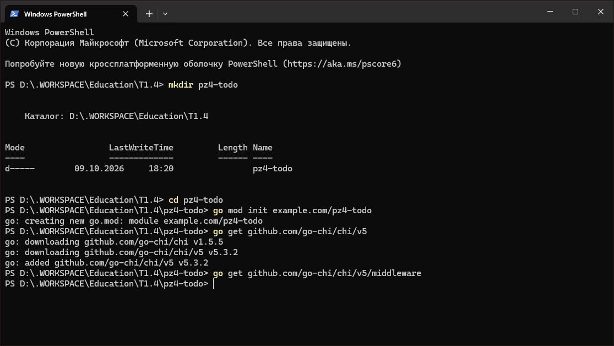

Файл `go.mod` после установки:

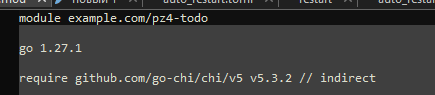
### Шаг 2. Модель и хранилище в памяти

**`internal/task/model.go`**

```go
package task

import "time"

type Task struct {
	ID        int64     `json:"id"`
	Title     string    `json:"title"`
	Done      bool      `json:"done"`
	CreatedAt time.Time `json:"created_at"`
	UpdatedAt time.Time `json:"updated_at"`
}
```

**`internal/task/repo.go`**

```go
package task

import (
	"errors"
	"sync"
	"time"
)

var ErrNotFound = errors.New("task not found")

type Repo struct {
	mu    sync.RWMutex
	seq   int64
	items map[int64]*Task
}

func NewRepo() *Repo {
	return &Repo{items: make(map[int64]*Task)}
}

func (r *Repo) List() []*Task {
	r.mu.RLock()
	defer r.mu.RUnlock()
	out := make([]*Task, 0, len(r.items))
	for _, t := range r.items {
		out = append(out, t)
	}
	return out
}

func (r *Repo) Get(id int64) (*Task, error) {
	r.mu.RLock()
	defer r.mu.RUnlock()
	t, ok := r.items[id]
	if !ok {
		return nil, ErrNotFound
	}
	return t, nil
}

func (r *Repo) Create(title string) *Task {
	r.mu.Lock()
	defer r.mu.Unlock()
	r.seq++
	now := time.Now()
	t := &Task{
		ID:        r.seq,
		Title:     title,
		CreatedAt: now,
		UpdatedAt: now,
		Done:      false,
	}
	r.items[t.ID] = t
	return t
}

func (r *Repo) Update(id int64, title string, done bool) (*Task, error) {
	r.mu.Lock()
	defer r.mu.Unlock()
	t, ok := r.items[id]
	if !ok {
		return nil, ErrNotFound
	}
	t.Title = title
	t.Done = done
	t.UpdatedAt = time.Now()
	return t, nil
}

func (r *Repo) Delete(id int64) error {
	r.mu.Lock()
	defer r.mu.Unlock()
	if _, ok := r.items[id]; !ok {
		return ErrNotFound
	}
	delete(r.items, id)
	return nil
}
```
### Шаг 3. Handlers: JSON API

**`internal/task/handler.go`**

```go
package task

import (
	"encoding/json"
	"net/http"
	"strconv"

	"github.com/go-chi/chi/v5"
)

type Handler struct {
	repo *Repo
}

func NewHandler(repo *Repo) *Handler {
	return &Handler{repo: repo}
}

func (h *Handler) Routes() chi.Router {
	r := chi.NewRouter()
	r.Get("/", h.list)          // GET    /tasks
	r.Post("/", h.create)       // POST   /tasks
	r.Get("/{id}", h.get)       // GET    /tasks/{id}
	r.Put("/{id}", h.update)    // PUT    /tasks/{id}
	r.Delete("/{id}", h.delete) // DELETE /tasks/{id}
	return r
}

func (h *Handler) list(w http.ResponseWriter, r *http.Request) {
	writeJSON(w, http.StatusOK, h.repo.List())
}

func (h *Handler) get(w http.ResponseWriter, r *http.Request) {
	id, bad := parseID(w, r)
	if bad {
		return
	}
	t, err := h.repo.Get(id)
	if err != nil {
		httpError(w, http.StatusNotFound, err.Error())
		return
	}
	writeJSON(w, http.StatusOK, t)
}

type createReq struct {
	Title string `json:"title"`
}

func (h *Handler) create(w http.ResponseWriter, r *http.Request) {
	var req createReq
	if err := json.NewDecoder(r.Body).Decode(&req); err != nil || req.Title == "" {
		httpError(w, http.StatusBadRequest, "invalid json: require non-empty title")
		return
	}
	t := h.repo.Create(req.Title)
	writeJSON(w, http.StatusCreated, t)
}

type updateReq struct {
	Title string `json:"title"`
	Done  bool   `json:"done"`
}

func (h *Handler) update(w http.ResponseWriter, r *http.Request) {
	id, bad := parseID(w, r)
	if bad {
		return
	}
	var req updateReq
	if err := json.NewDecoder(r.Body).Decode(&req); err != nil || req.Title == "" {
		httpError(w, http.StatusBadRequest, "invalid json: require non-empty title")
		return
	}
	t, err := h.repo.Update(id, req.Title, req.Done)
	if err != nil {
		httpError(w, http.StatusNotFound, err.Error())
		return
	}
	writeJSON(w, http.StatusOK, t)
}

func (h *Handler) delete(w http.ResponseWriter, r *http.Request) {
	id, bad := parseID(w, r)
	if bad {
		return
	}
	if err := h.repo.Delete(id); err != nil {
		httpError(w, http.StatusNotFound, err.Error())
		return
	}
	w.WriteHeader(http.StatusNoContent)
}

// helpers

func parseID(w http.ResponseWriter, r *http.Request) (int64, bool) {
	raw := chi.URLParam(r, "id")
	id, err := strconv.ParseInt(raw, 10, 64)
	if err != nil || id <= 0 {
		httpError(w, http.StatusBadRequest, "invalid id")
		return 0, true
	}
	return id, false
}

func writeJSON(w http.ResponseWriter, code int, v any) {
	w.Header().Set("Content-Type", "application/json; charset=utf-8")
	w.WriteHeader(code)
	_ = json.NewEncoder(w).Encode(v)
}

func httpError(w http.ResponseWriter, code int, msg string) {
	writeJSON(w, code, map[string]string{"error": msg})
}
```
### Шаг 4. Middleware: логирование и CORS

**`pkg/middleware/logger.go`**

```go
package middleware

import (
	"log"
	"net/http"
	"time"
)

func Logger(next http.Handler) http.Handler {
	return http.HandlerFunc(func(w http.ResponseWriter, r *http.Request) {
		start := time.Now()
		next.ServeHTTP(w, r)
		log.Printf("%s %s %s", r.Method, r.URL.Path, time.Since(start))
	})
}
```

**`pkg/middleware/cors.go`**

```go
package middleware

import "net/http"

func SimpleCORS(next http.Handler) http.Handler {
	return http.HandlerFunc(func(w http.ResponseWriter, r *http.Request) {
		w.Header().Set("Access-Control-Allow-Origin", "*")
		w.Header().Set("Access-Control-Allow-Methods", "GET,POST,PUT,DELETE,OPTIONS")
		w.Header().Set("Access-Control-Allow-Headers", "Content-Type, Authorization")
		if r.Method == http.MethodOptions {
			w.WriteHeader(http.StatusNoContent)
			return
		}
		next.ServeHTTP(w, r)
	})
}
```
### Шаг 5. main.go: сборка приложения

```go
package main

import (
	"log"
	"net/http"

	"github.com/go-chi/chi/v5"
	chimw "github.com/go-chi/chi/v5/middleware"

	"example.com/pz4-todo/internal/task"
	myMW "example.com/pz4-todo/pkg/middleware"
)

func main() {
	repo := task.NewRepo()
	h := task.NewHandler(repo)

	r := chi.NewRouter()

	// встроенные middleware chi
	r.Use(chimw.RequestID)
	r.Use(chimw.RealIP)
	r.Use(chimw.Recoverer)

	// свои middleware
	r.Use(myMW.Logger)
	r.Use(myMW.SimpleCORS)

	// монтируем поддерево /tasks
	r.Mount("/tasks", h.Routes())

	log.Println("Server started on :8080")
	if err := http.ListenAndServe(":8080", r); err != nil {
		log.Fatal(err)
	}
}
```
### Шаг 6. Запуск сервера

Запустим сервер:

```go
go mod tidy
go run .
```

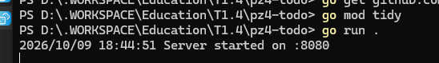
## Примеры запросов и ответы

### 3.1. Создание задачи (POST /tasks)

Для удобства пропишем:
`$base = "http://localhost:8080"`

```powershell
$body = '{"title":"Купить молоко"}'

$resp = Invoke-WebRequest -Uri "$base/tasks" `
    -Method Post `
    -ContentType "application/json" `
    -Body $body `
    -UseBasicParsing

$resp.StatusCode
$resp.Content
```

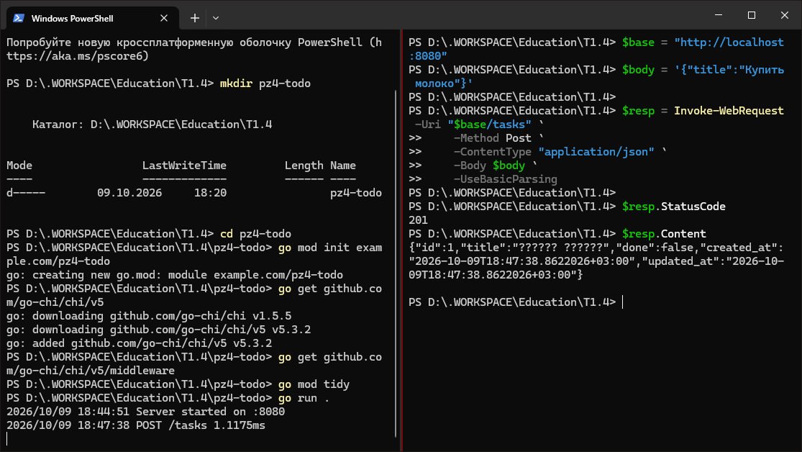

Создадим вторую задачу:

```powershell
$body2 = '{"title":"Сделать ПЗ №4"}'
$resp2 = Invoke-WebRequest -Uri "$base/tasks" `
    -Method Post `
    -ContentType "application/json" `
    -Body $body2 `
    -UseBasicParsing
$resp2.StatusCode
$resp2.Content
```

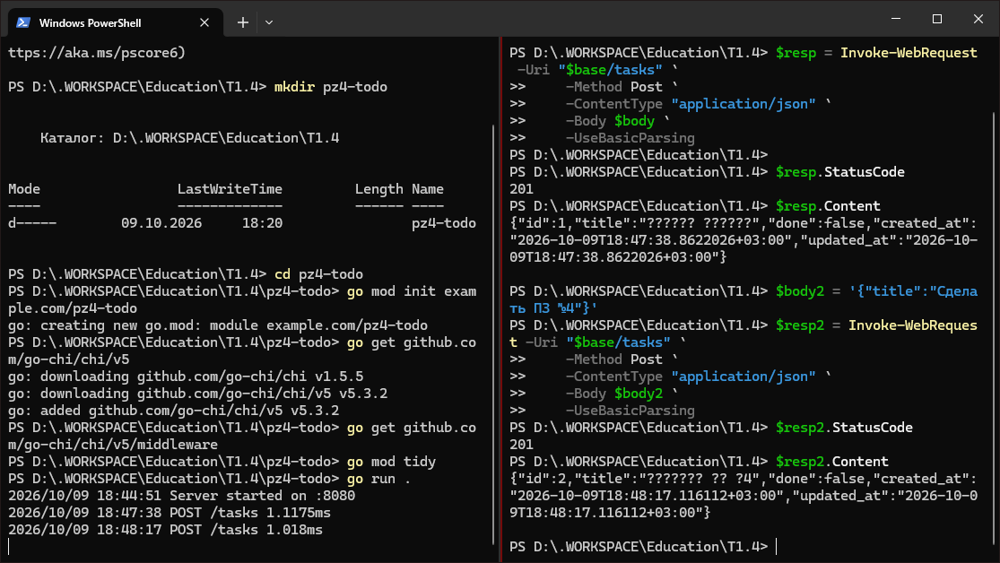
### 3.2. Получение списка (GET /tasks)

```powershell
$resp = Invoke-WebRequest -Uri "$base/tasks" -Method Get -UseBasicParsing
$resp.StatusCode
$resp.Content | ConvertFrom-Json | ConvertTo-Json -Depth 5
```

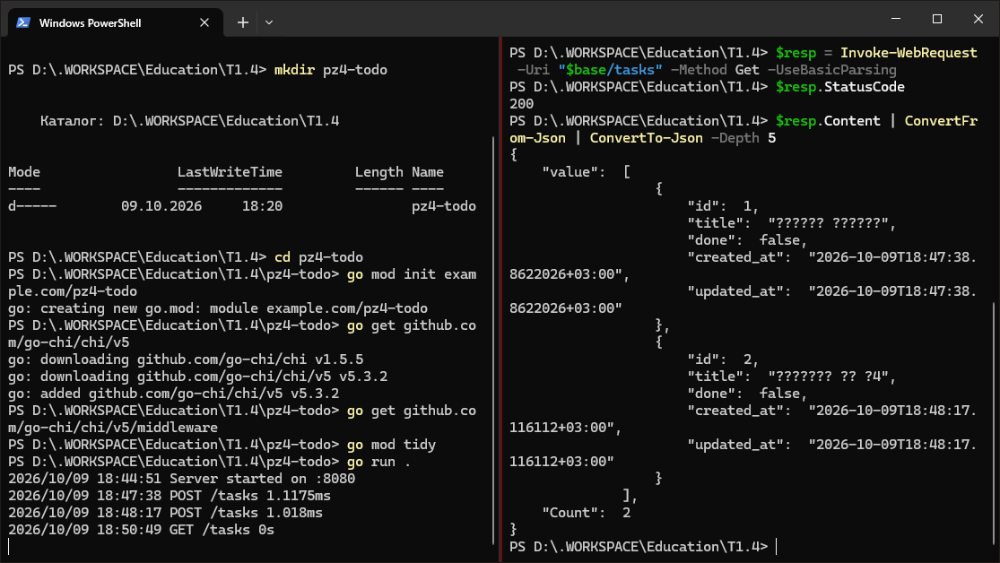
### 3.3. Получение одной задачи (GET /tasks/{id})

```powershell
$resp = Invoke-WebRequest -Uri "$base/tasks/1" -Method Get -UseBasicParsing
$resp.StatusCode
$resp.Content | ConvertFrom-Json | ConvertTo-Json -Depth 5
```

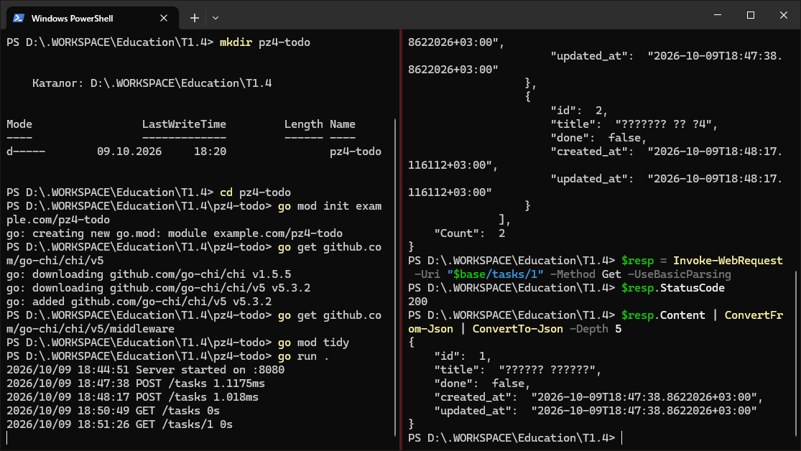
### 3.4. Обновление задачи (PUT /tasks/{id})

```powershell
$body = '{"title":"Купить молоко и хлеб","done":true}'

$resp = Invoke-WebRequest -Uri "$base/tasks/1" `
    -Method Put `
    -ContentType "application/json" `
    -Body $body `
    -UseBasicParsing

$resp.StatusCode
$resp.Content | ConvertFrom-Json | ConvertTo-Json -Depth 5
```

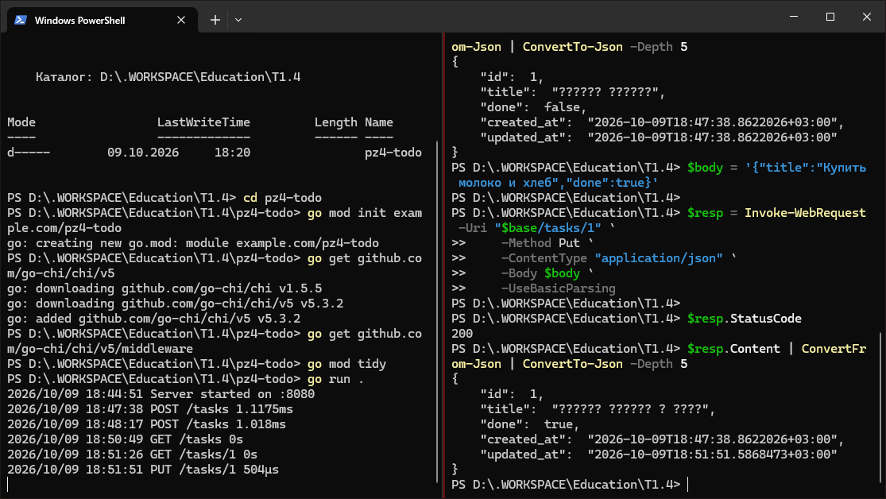
### 3.5. Удаление задачи (DELETE /tasks/{id})

```powershell
$resp = Invoke-WebRequest -Uri "$base/tasks/2" -Method Delete -UseBasicParsing
$resp.StatusCode
$resp.Content
```

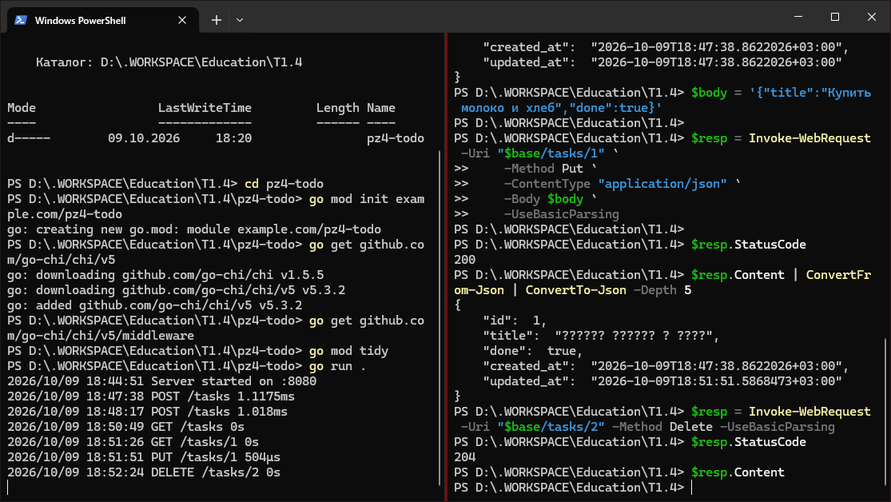
### 3.6. Проверка обработки ошибок
#### 3.6.1. Пустой заголовок -> 400

```powershell
$body = '{"title":""}'
try {
    Invoke-WebRequest -Uri "$base/tasks" -Method Post `
        -ContentType "application/json" -Body $body -UseBasicParsing
} catch {
    $_.Exception.Response.StatusCode.value__
    $reader = New-Object System.IO.StreamReader($_.Exception.Response.GetResponseStream())
    $reader.ReadToEnd()
}
```

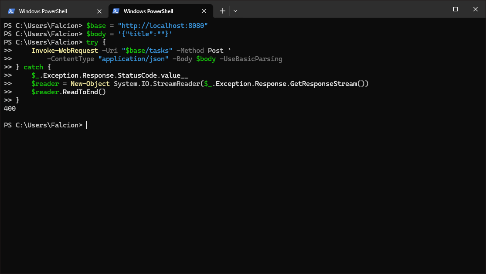

Получаем ошибку 400.
#### 3.6.2. Некорректный id -> 400

```powershell
try {
    Invoke-WebRequest -Uri "$base/tasks/abc" -Method Get -UseBasicParsing
} catch {
    $_.Exception.Response.StatusCode.value__
    $sr = New-Object System.IO.StreamReader($_.Exception.Response.GetResponseStream())
    $sr.ReadToEnd()
}
```

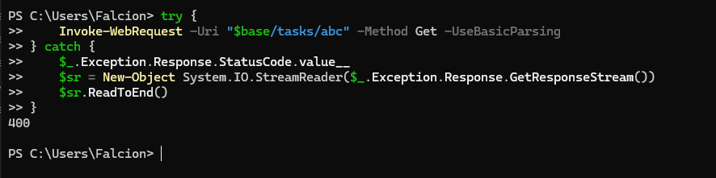

Получаем ошибку 400.
#### 3.6.3. Несуществующая задача -> 404

```powershell
try {
    Invoke-WebRequest -Uri "$base/tasks/999" -Method Get -UseBasicParsing
} catch {
    $_.Exception.Response.StatusCode.value__
    $sr = New-Object System.IO.StreamReader($_.Exception.Response.GetResponseStream())
    $sr.ReadToEnd()
}
```

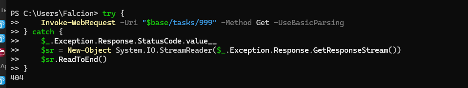

Ошибка 404 Not Found.

